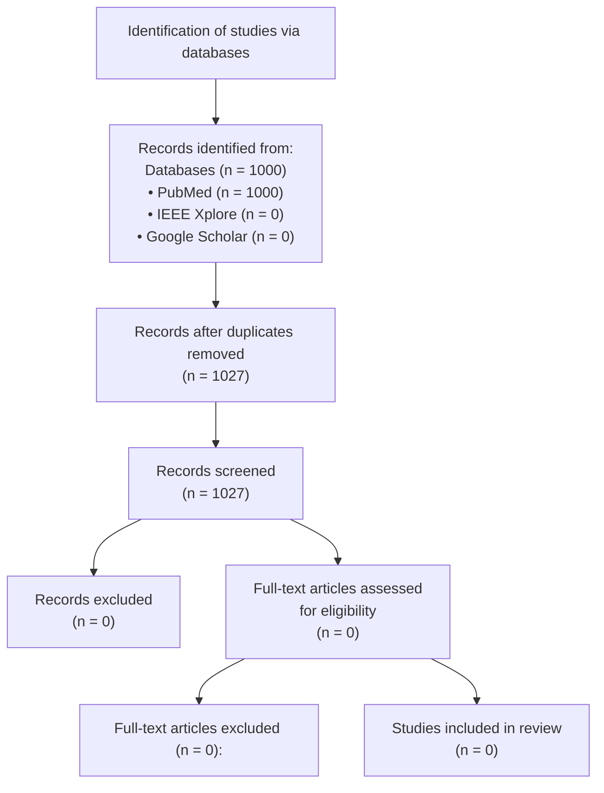

# PRISMA 2020 Flow Diagram

```mermaid
flowchart TB
    id1["Identification of studies via databases"]
    id2["Records identified from:
    Databases (n = 1000)
    • PubMed (n = 1000)
    • IEEE Xplore (n = 0)
    • Google Scholar (n = 0)"]
    id3["Records after duplicates removed
(n = 1027)"]
    id4["Records screened
(n = 1027)"]
    id5["Records excluded
(n = 0)"]
    id6["Full-text articles assessed 
for eligibility
(n = 0)"]
    id7["Full-text articles excluded (n = 0):"]
    id8["Studies included in review
(n = 0)"]
    id1 --> id2
    id2 --> id3
    id3 --> id4
    id4 --> id5
    id4 --> id6
    id6 --> id7
    id6 --> id8
```