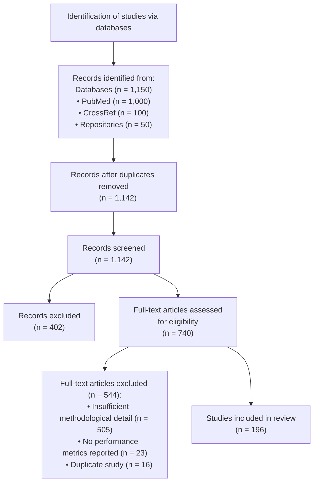

# PRISMA 2020 Flow Diagram

## Plain Text Version for Publication

### Identification
* Records identified through databases (n = 1,150)
  - PubMed (n = 1,000)
  - CrossRef (n = 100)
  - Repositories (n = 50)

### Screening
* Records after duplicates removed (n = 1,142)
* Records screened (n = 1,142)
* Records excluded at screening (n = 402)

### Eligibility
* Full-text articles assessed for eligibility (n = 740)
* Full-text articles excluded (n = 544), with reasons:
  - Insufficient methodological detail (n = 505)
  - No performance metrics reported (n = 23)
  - Duplicate study (n = 16)

### Included
* Studies included in final review (n = 196)

*Note: This diagram follows PRISMA 2020 guidelines. The Mermaid diagram can be rendered in tools that support Mermaid syntax, or use the plain text version for creating the diagram in your preferred visualization tool.